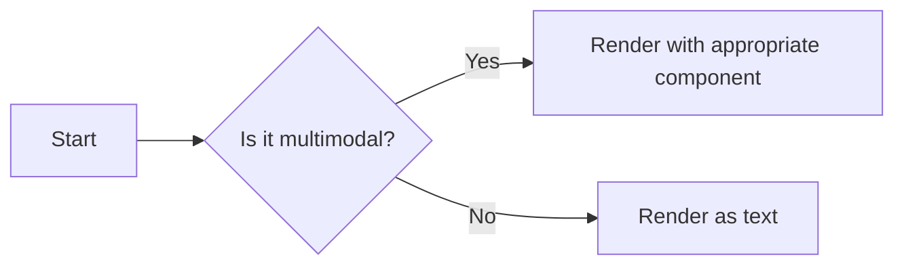

# Multimodal Test Document

## 1. Text Content
This is a regular text paragraph demonstrating the chat interface's ability to render plain text.

## 2. Code Blocks
```python
def hello_world():
    print("Hello from Lexos!")
```

## 3. Images


## 4. Mermaid Diagram


## 5. Charts
```chart
{
  "type": "pie",
  "data": {
    "labels": ["Text", "Images", "Code", "Diagrams"],
    "datasets": [{
      "data": [30, 25, 25, 20],
      "backgroundColor": ["#FF6384", "#36A2EB", "#FFCE56", "#4BC0C0"]
    }]
  }
}
```

## 6. Video
<video controls>
  <source src="https://www.w3schools.com/html/mov_bbb.mp4" type="video/mp4">
</video>